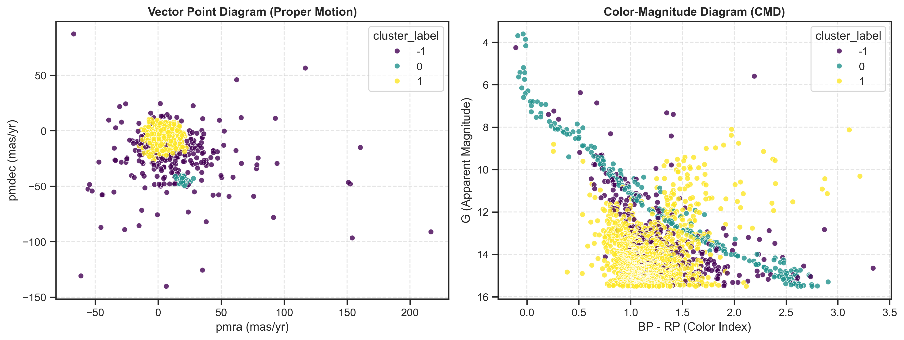

# Summary

`gaia_pyspark_pipeline` is a Python software package that combines the benefits of PySpark parallel processing to efficiently analyze Gaia DR3 big data, while utilizing machine learning libraries from Scikit-Learn and the DBSCAN algorithm to identify and analyze stellar clusters (such as Orion and the Pleiades). Benchmarking results demonstrate high scalability and efficiency across massive astronomical datasets.

# Statement of Need
The Gaia DR3 archive contains high-precision astrometric and photometric parameters for over 1.8 billion celestial sources. If a researcher wants to work on a massive dataset, it will consume heavy RAM resources for data processing and filtering. There is a clear lack of tools that allow researchers to leverage data engineering and parallel processing techniques via PySpark, which offer power and speed in handling big data—unlike traditional tools such as Pandas, which become very slow and lack the ability to scale with the volume of data. Despite the availability of distributed computing power, there remains a gap for ready and open-source tools that seamlessly integrate automated data retrieval (AstroQuery), highly efficient distributed processing, and the application of spatial clustering algorithms (DBSCAN) for analyzing massive stellar fields and clusters (such as Orion and the Pleiades).Therefore, gaia\_pyspark\_pipeline was introduced as a reliable engineering solution that provides integrated distributed processing, reduces execution time, and ensures reproducible results and scalability testing, making it easier for researchers to handle Gaia’s massive datasets without the complexity of the underlying infrastructure.The Pipeline represents a PySpark distributed processing framework for astronomical data, and the Pleiades star cluster was selected as a case study and performance benchmark.

 # Draft Physics Section - [Under Review]
 

# Pipeline Architecture & Core Modules

The software architecture is divided into three modular components:

1. **Astrometric Querying (`fetch_data.py`):** Interfaces with the Gaia Archive via `astroquery.gaia` using Astronomical Data Query Language (ADQL) [@astropy]. It extracts sky coordinates ($\alpha$, $\delta$), proper motion components ($\mu_{\alpha}^*$, $\mu_{\delta}$), parallax ($\varpi$), and $G$, $BP$, $RP$ photometric magnitudes.
2. **Distributed Data Cleaning (`spark_cleaner.py`):** Initializes a PySpark environment to clean raw Parquet files in memory. It filters out unphysical negative parallaxes, missing values, and corrupted photometric records. It includes an automated benchmarking sub-module (`benchmark_pyspark_performance`) that measures cleaning time scalability across subsampled fractions.
3. **Kinematic Clustering & Validation (`clustering.py`):** Executes DBSCAN clustering [@dbscan; @scikit-learn] on the proper motion vector space ($\mu_{\alpha}^*$, $\mu_{\delta}$) to separate candidate cluster members from field noise. It automatically generates publication-ready Vector Point Diagrams (VPD) and Color-Magnitude Diagrams (CMD) for physical validation.

# Demonstration & Scientific Verification

To validate the pipeline's accuracy and performance, `gaia_pyspark_pipeline` was applied to a $1.0^\circ$ cone search centered on the Pleiades open cluster (M45: $\alpha = 56.75^\circ$, $\delta = 24.12^\circ$). 

As shown in \autoref{fig:cluster}, the pipeline successfully isolated the Pleiades cluster members around ($\mu_{\alpha}^* \approx 20$, $\mu_{\delta} \approx -45 \text{ mas/yr}$). The resulting Color-Magnitude Diagram confirms that the clustered stars strictly adhere to the theoretical Main Sequence evolutionary track, demonstrating both kinematic and astrophysical consistency. Performance benchmarks confirmed sub-second execution ($<0.25\text{ seconds}$) for all PySpark transformation steps.

# Acknowledgements

We acknowledge the use of data from the European Space Agency (ESA) mission Gaia, processed by the Gaia Data Processing and Analysis Consortium (DPAC).

# References

Data extraction was automated using astroquery [cite of astropy/astroquery](https://astroquery.readthedocs.io/en/latest/), data cleaning and scalability benchmarking were performed via distributed computing using `PySpark` [cite of Spark paper](https://dl.acm.org/doi/fullHtml/10.1145/2934664), and kinematic clustering was executed using the DBSCAN algorithm [original DBSCAN paper](https://dl.acm.org/doi/10.5555/3001460.3001507) via `scikit-learn`.
ent}