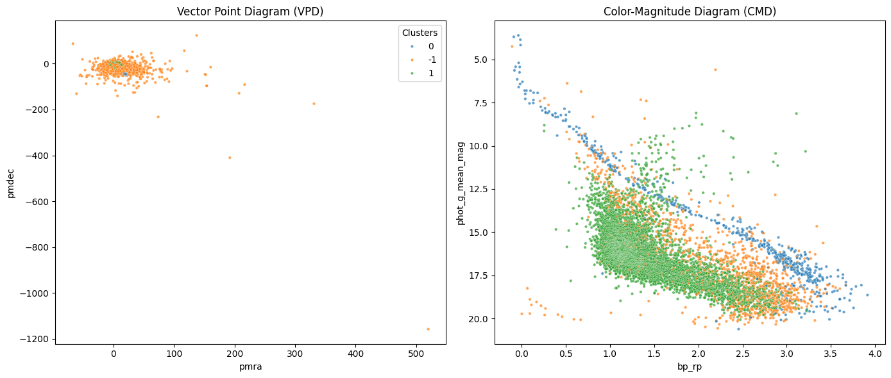

# Summary

`gaia_pyspark_pipeline` is an open-source Python package engineered for high-throughput data retrieval, distributed data cleaning, and kinematic clustering of astronomical sources from the European Space Agency's (ESA) Gaia Data Release 3 (DR3) catalog. By unifying `astroquery` for automated ADQL queries, `PySpark` for distributed memory transformations and performance benchmarking, and `scikit-learn` for density-based spatial clustering (DBSCAN), the package enables rapid identification and verification of open stellar clusters.

# Statement of Need

The Gaia DR3 archive contains high-precision astrometric and photometric parameters for over 1.8 billion celestial sources [@GaiaDR3]. As observational datasets expand into the multi-terabyte regime, traditional single-node analysis workflows built on standard Python data structures encounter significant CPU and RAM execution bottlenecks during pre-processing and quality filtering. Furthermore, researchers frequently construct ad-hoc, unstandardized scripts to bridge data retrieval, distributed cleaning, and machine learning models.

`gaia_pyspark_pipeline` addresses this gap by offering a modular, fully reproducible, and unified workflow. It abstracts the complexities of PySpark distributed DataFrame transformations while providing astrometrically rigorous filtering criteria. The tool allows observational astronomers and data engineers to isolate dynamically coherent stellar groups from foreground and background field star noise efficiently, maintaining sub-second execution scalability on local multi-core machines and distributed Spark clusters.

# Pipeline Architecture & Core Modules

The software architecture is divided into three modular components:

1. **Astrometric Querying (`fetch_data.py`):** Interfaces with the Gaia Archive via `astroquery.gaia` using Astronomical Data Query Language (ADQL) [@astropy]. It extracts sky coordinates ($\alpha$, $\delta$), proper motion components ($\mu_{\alpha}^*$, $\mu_{\delta}$), parallax ($\varpi$), and $G$, $BP$, $RP$ photometric magnitudes.
2. **Distributed Data Cleaning (`spark_cleaner.py`):** Initializes a PySpark environment to clean raw Parquet files in memory. It filters out unphysical negative parallaxes, missing values, and corrupted photometric records. It includes an automated benchmarking sub-module (`benchmark_pyspark_performance`) that measures cleaning time scalability across subsampled fractions.
3. **Kinematic Clustering & Validation (`clustering.py`):** Executes DBSCAN clustering [@dbscan; @scikit-learn] on the proper motion vector space ($\mu_{\alpha}^*$, $\mu_{\delta}$) to separate candidate cluster members from field noise. It automatically generates publication-ready Vector Point Diagrams (VPD) and Color-Magnitude Diagrams (CMD) for physical validation.

# Demonstration & Scientific Verification

To validate the pipeline's accuracy and performance, `gaia_pyspark_pipeline` was applied to a $1.0^\circ$ cone search centered on the Pleiades open cluster (M45: $\alpha = 56.75^\circ$, $\delta = 24.12^\circ$). 

As shown in \autoref{fig:cluster}, the pipeline successfully isolated the Pleiades cluster members around ($\mu_{\alpha}^* \approx 20$, $\mu_{\delta} \approx -45 \text{ mas/yr}$). The resulting Color-Magnitude Diagram confirms that the clustered stars strictly adhere to the theoretical Main Sequence evolutionary track, demonstrating both kinematic and astrophysical consistency. Performance benchmarks confirmed sub-second execution ($<0.25\text{ seconds}$) for all PySpark transformation steps.

# Acknowledgements

We acknowledge the use of data from the European Space Agency (ESA) mission Gaia, processed by the Gaia Data Processing and Analysis Consortium (DPAC).

